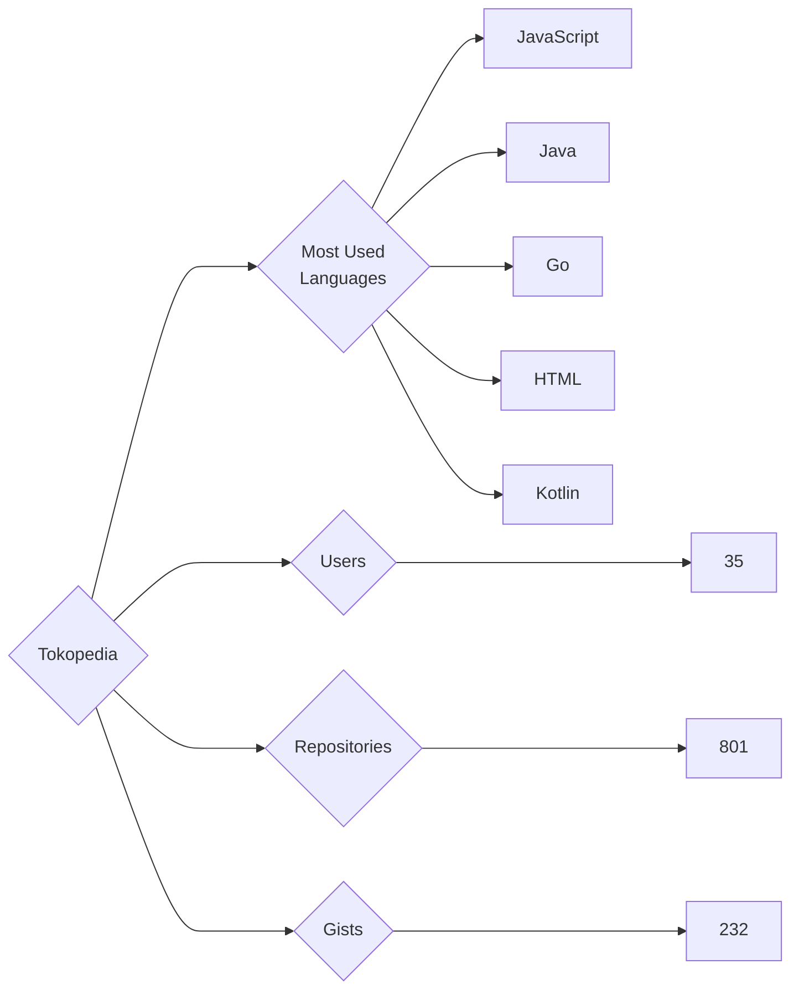

<h1 align="center">Tokopedia</h1>

```mermaid
graph LR
COMPANY_NAME{Tokopedia}
COMPANY_NAME ---> U{Users} ---> UN[35]
COMPANY_NAME ---> R{Repositories} ---> RN[801]
COMPANY_NAME ---> G{Gists} ---> GN[232]
COMPANY_NAME ---> ML{Most Used<br>Languages}
ML --> JavaScript[JavaScript]
ML --> Java[Java]
ML --> Go[Go]
ML --> HTML[HTML]
ML --> Kotlin[Kotlin]
```
