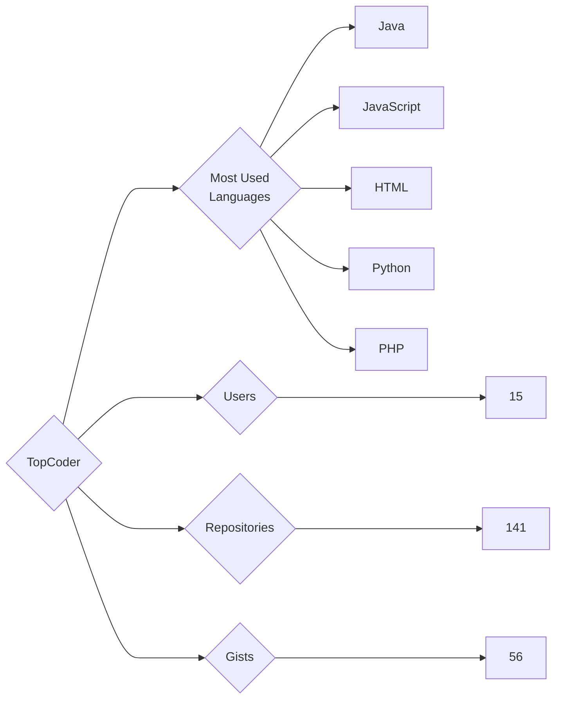

<h1 align="center">TopCoder</h1>

```mermaid
graph LR
COMPANY_NAME{TopCoder}
COMPANY_NAME ---> U{Users} ---> UN[15]
COMPANY_NAME ---> R{Repositories} ---> RN[141]
COMPANY_NAME ---> G{Gists} ---> GN[56]
COMPANY_NAME ---> ML{Most Used<br>Languages}
ML --> Java[Java]
ML --> JavaScript[JavaScript]
ML --> HTML[HTML]
ML --> Python[Python]
ML --> PHP[PHP]
```
