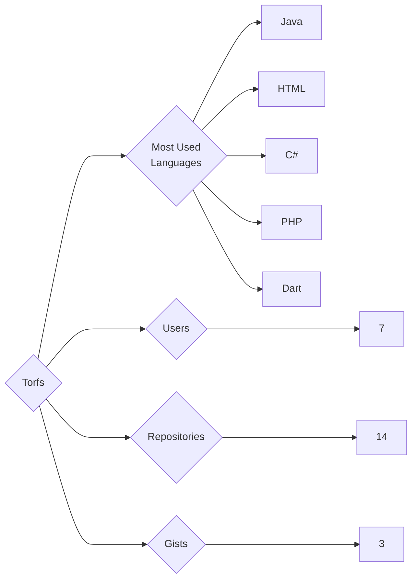

<h1 align="center">Torfs</h1>

```mermaid
graph LR
COMPANY_NAME{Torfs}
COMPANY_NAME ---> U{Users} ---> UN[7]
COMPANY_NAME ---> R{Repositories} ---> RN[14]
COMPANY_NAME ---> G{Gists} ---> GN[3]
COMPANY_NAME ---> ML{Most Used<br>Languages}
ML --> Java[Java]
ML --> HTML[HTML]
ML --> C#[C#]
ML --> PHP[PHP]
ML --> Dart[Dart]
```
