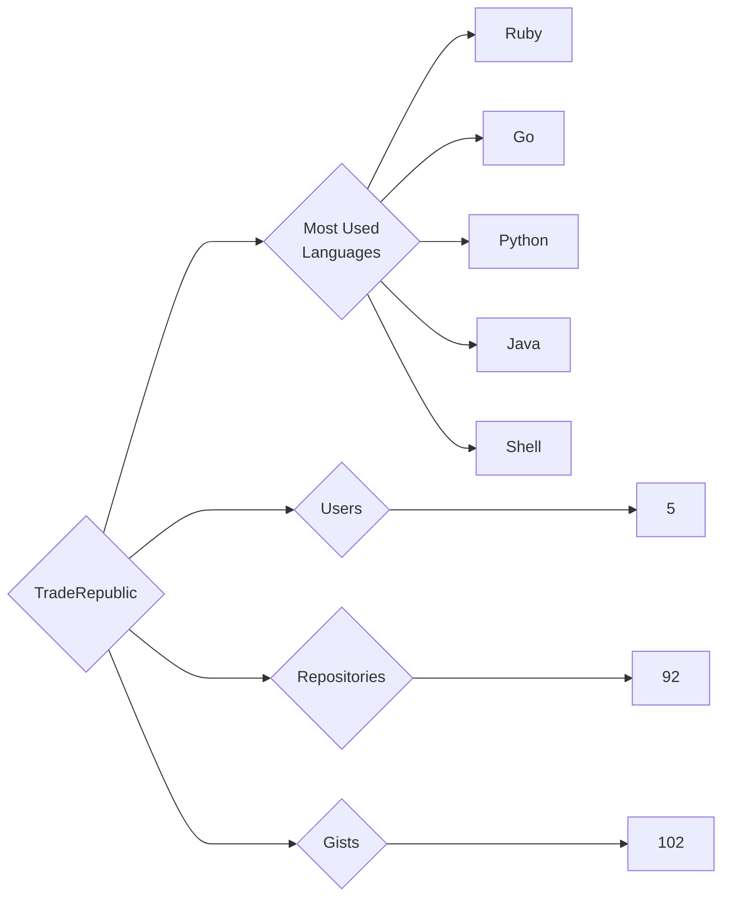

<h1 align="center">TradeRepublic</h1>

```mermaid
graph LR
COMPANY_NAME{TradeRepublic}
COMPANY_NAME ---> U{Users} ---> UN[5]
COMPANY_NAME ---> R{Repositories} ---> RN[92]
COMPANY_NAME ---> G{Gists} ---> GN[102]
COMPANY_NAME ---> ML{Most Used<br>Languages}
ML --> Ruby[Ruby]
ML --> Go[Go]
ML --> Python[Python]
ML --> Java[Java]
ML --> Shell[Shell]
```
