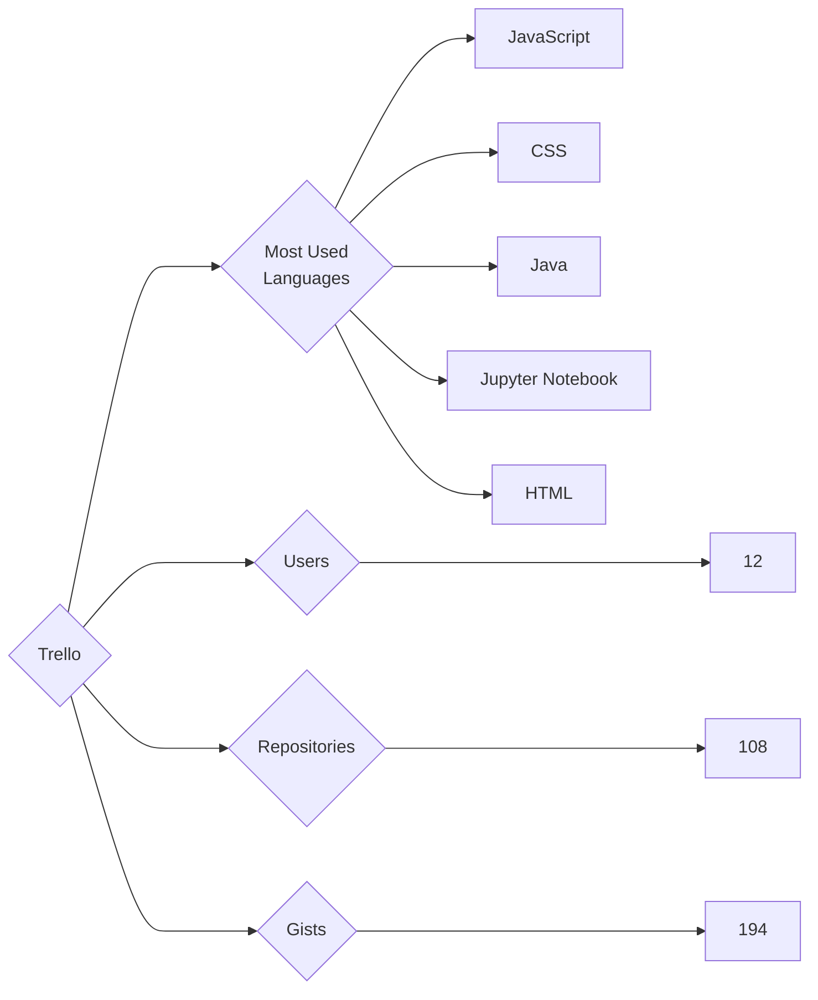

<h1 align="center">Trello</h1>

```mermaid
graph LR
COMPANY_NAME{Trello}
COMPANY_NAME ---> U{Users} ---> UN[12]
COMPANY_NAME ---> R{Repositories} ---> RN[108]
COMPANY_NAME ---> G{Gists} ---> GN[194]
COMPANY_NAME ---> ML{Most Used<br>Languages}
ML --> JavaScript[JavaScript]
ML --> CSS[CSS]
ML --> Java[Java]
ML --> Jupyter_Notebook[Jupyter Notebook]
ML --> HTML[HTML]
```
