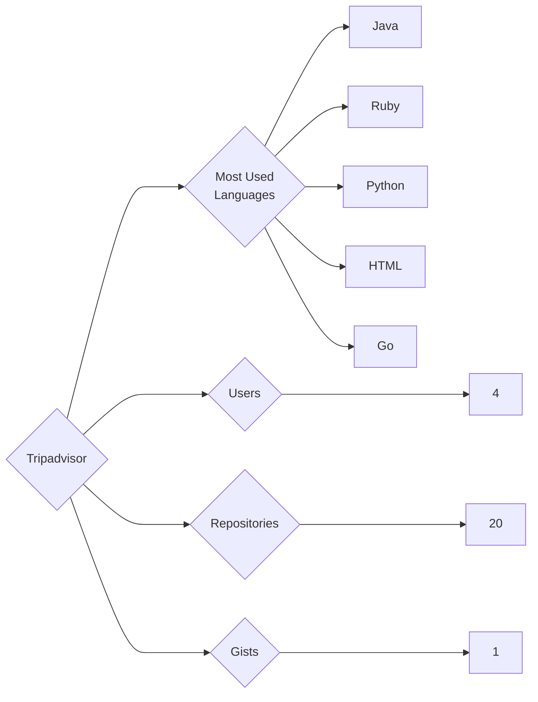

<h1 align="center">Tripadvisor</h1>

```mermaid
graph LR
COMPANY_NAME{Tripadvisor}
COMPANY_NAME ---> U{Users} ---> UN[4]
COMPANY_NAME ---> R{Repositories} ---> RN[20]
COMPANY_NAME ---> G{Gists} ---> GN[1]
COMPANY_NAME ---> ML{Most Used<br>Languages}
ML --> Java[Java]
ML --> Ruby[Ruby]
ML --> Python[Python]
ML --> HTML[HTML]
ML --> Go[Go]
```
