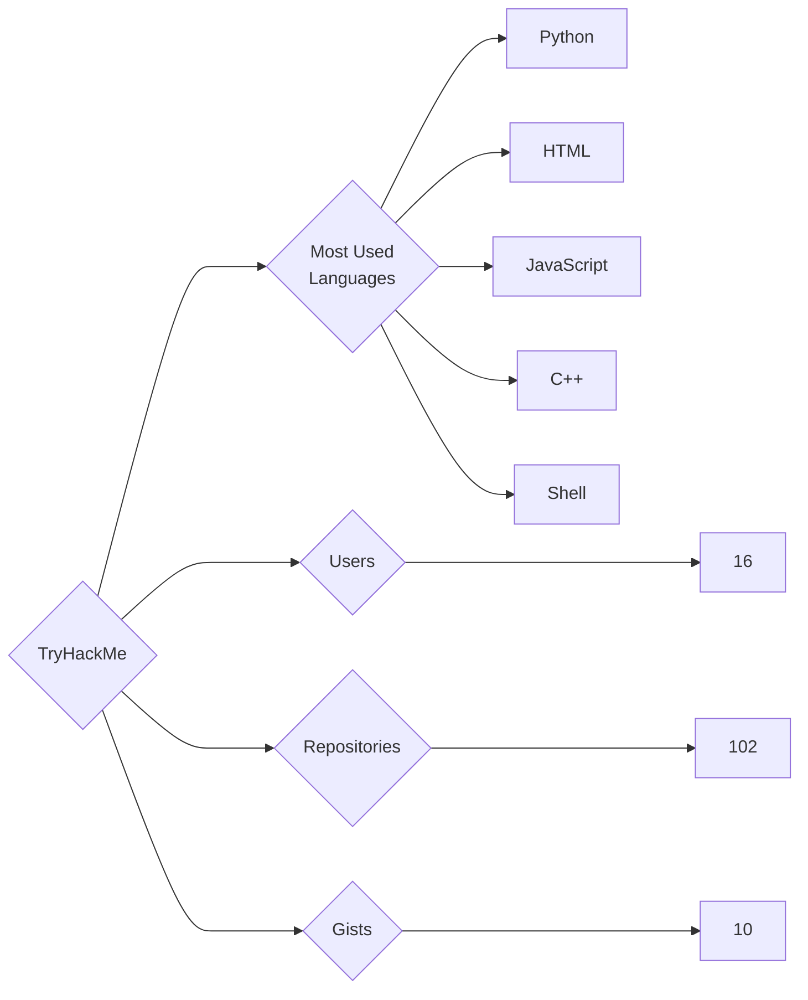

<h1 align="center">TryHackMe</h1>

```mermaid
graph LR
COMPANY_NAME{TryHackMe}
COMPANY_NAME ---> U{Users} ---> UN[16]
COMPANY_NAME ---> R{Repositories} ---> RN[102]
COMPANY_NAME ---> G{Gists} ---> GN[10]
COMPANY_NAME ---> ML{Most Used<br>Languages}
ML --> Python[Python]
ML --> HTML[HTML]
ML --> JavaScript[JavaScript]
ML --> C++[C++]
ML --> Shell[Shell]
```
