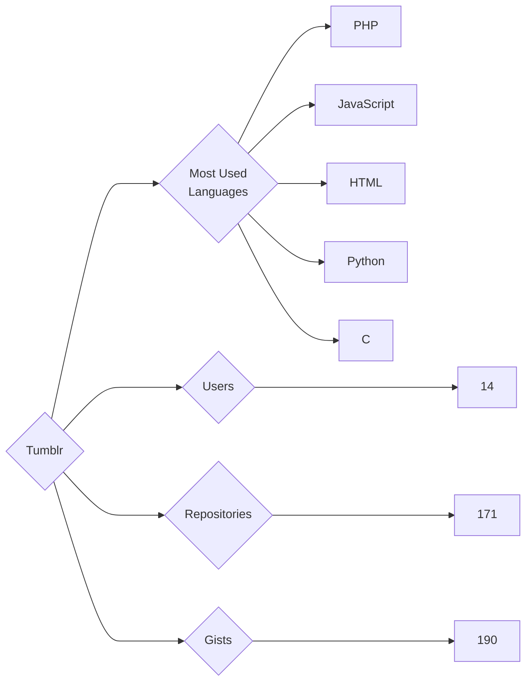

<h1 align="center">Tumblr</h1>

```mermaid
graph LR
COMPANY_NAME{Tumblr}
COMPANY_NAME ---> U{Users} ---> UN[14]
COMPANY_NAME ---> R{Repositories} ---> RN[171]
COMPANY_NAME ---> G{Gists} ---> GN[190]
COMPANY_NAME ---> ML{Most Used<br>Languages}
ML --> PHP[PHP]
ML --> JavaScript[JavaScript]
ML --> HTML[HTML]
ML --> Python[Python]
ML --> C[C]
```
