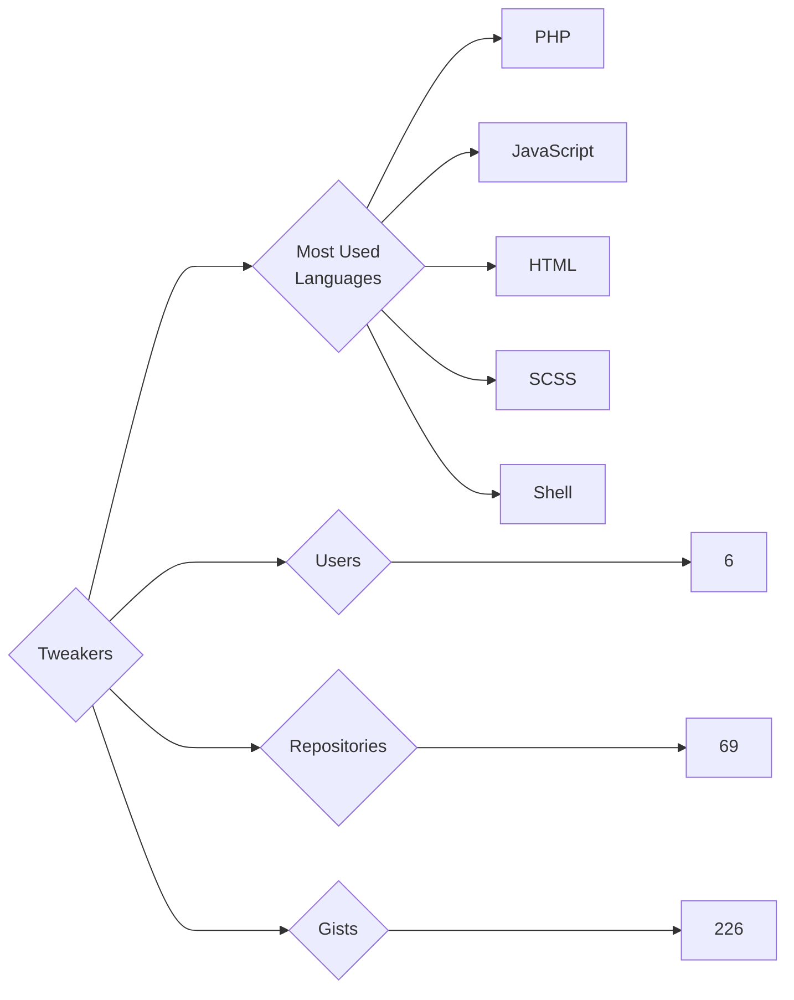

<h1 align="center">Tweakers</h1>

```mermaid
graph LR
COMPANY_NAME{Tweakers}
COMPANY_NAME ---> U{Users} ---> UN[6]
COMPANY_NAME ---> R{Repositories} ---> RN[69]
COMPANY_NAME ---> G{Gists} ---> GN[226]
COMPANY_NAME ---> ML{Most Used<br>Languages}
ML --> PHP[PHP]
ML --> JavaScript[JavaScript]
ML --> HTML[HTML]
ML --> SCSS[SCSS]
ML --> Shell[Shell]
```
