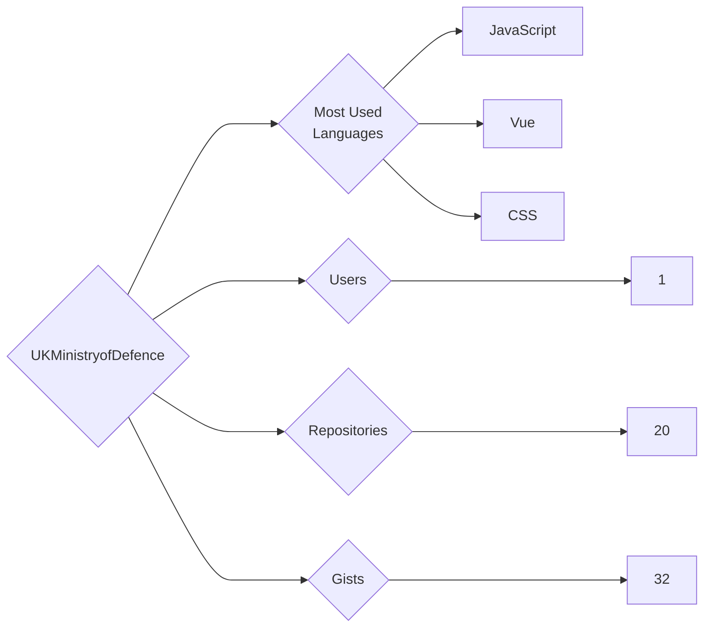

<h1 align="center">UKMinistryofDefence</h1>

```mermaid
graph LR
COMPANY_NAME{UKMinistryofDefence}
COMPANY_NAME ---> U{Users} ---> UN[1]
COMPANY_NAME ---> R{Repositories} ---> RN[20]
COMPANY_NAME ---> G{Gists} ---> GN[32]
COMPANY_NAME ---> ML{Most Used<br>Languages}
ML --> JavaScript[JavaScript]
ML --> Vue[Vue]
ML --> CSS[CSS]
```
