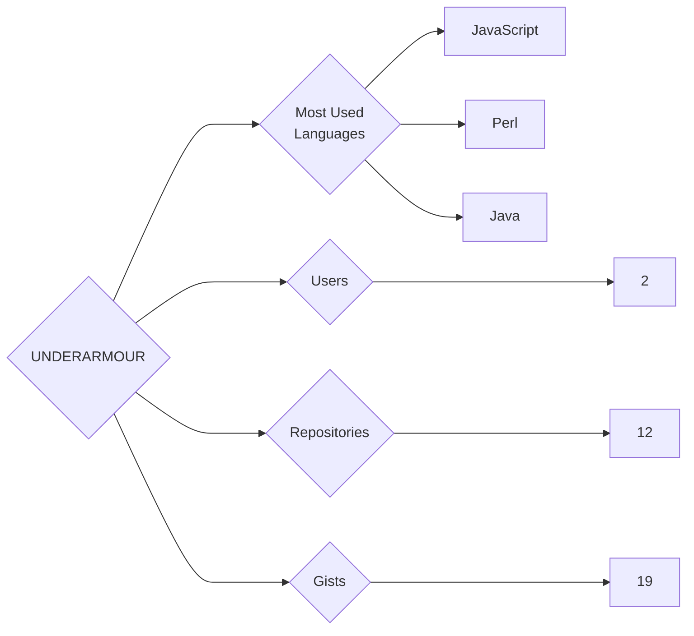

<h1 align="center">UNDERARMOUR</h1>

```mermaid
graph LR
COMPANY_NAME{UNDERARMOUR}
COMPANY_NAME ---> U{Users} ---> UN[2]
COMPANY_NAME ---> R{Repositories} ---> RN[12]
COMPANY_NAME ---> G{Gists} ---> GN[19]
COMPANY_NAME ---> ML{Most Used<br>Languages}
ML --> JavaScript[JavaScript]
ML --> Perl[Perl]
ML --> Java[Java]
```
