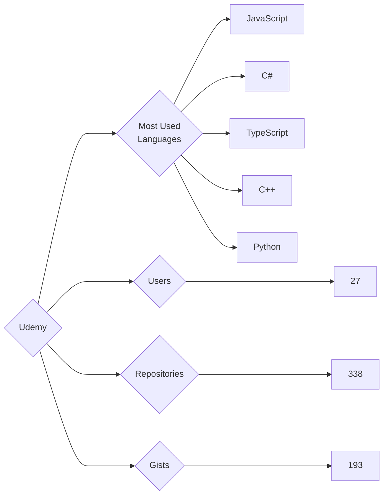

<h1 align="center">Udemy</h1>

```mermaid
graph LR
COMPANY_NAME{Udemy}
COMPANY_NAME ---> U{Users} ---> UN[27]
COMPANY_NAME ---> R{Repositories} ---> RN[338]
COMPANY_NAME ---> G{Gists} ---> GN[193]
COMPANY_NAME ---> ML{Most Used<br>Languages}
ML --> JavaScript[JavaScript]
ML --> C#[C#]
ML --> TypeScript[TypeScript]
ML --> C++[C++]
ML --> Python[Python]
```
