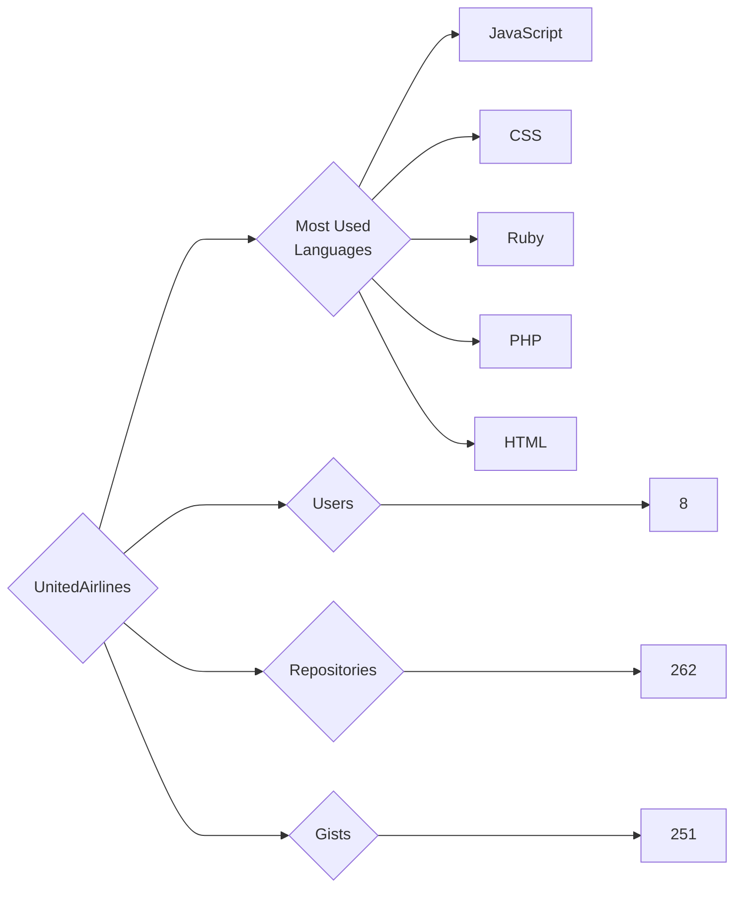

<h1 align="center">UnitedAirlines</h1>

```mermaid
graph LR
COMPANY_NAME{UnitedAirlines}
COMPANY_NAME ---> U{Users} ---> UN[8]
COMPANY_NAME ---> R{Repositories} ---> RN[262]
COMPANY_NAME ---> G{Gists} ---> GN[251]
COMPANY_NAME ---> ML{Most Used<br>Languages}
ML --> JavaScript[JavaScript]
ML --> CSS[CSS]
ML --> Ruby[Ruby]
ML --> PHP[PHP]
ML --> HTML[HTML]
```
