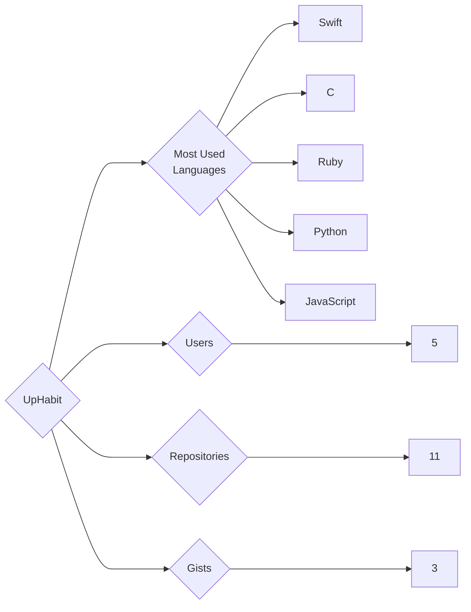

<h1 align="center">UpHabit</h1>

```mermaid
graph LR
COMPANY_NAME{UpHabit}
COMPANY_NAME ---> U{Users} ---> UN[5]
COMPANY_NAME ---> R{Repositories} ---> RN[11]
COMPANY_NAME ---> G{Gists} ---> GN[3]
COMPANY_NAME ---> ML{Most Used<br>Languages}
ML --> Swift[Swift]
ML --> C[C]
ML --> Ruby[Ruby]
ML --> Python[Python]
ML --> JavaScript[JavaScript]
```
