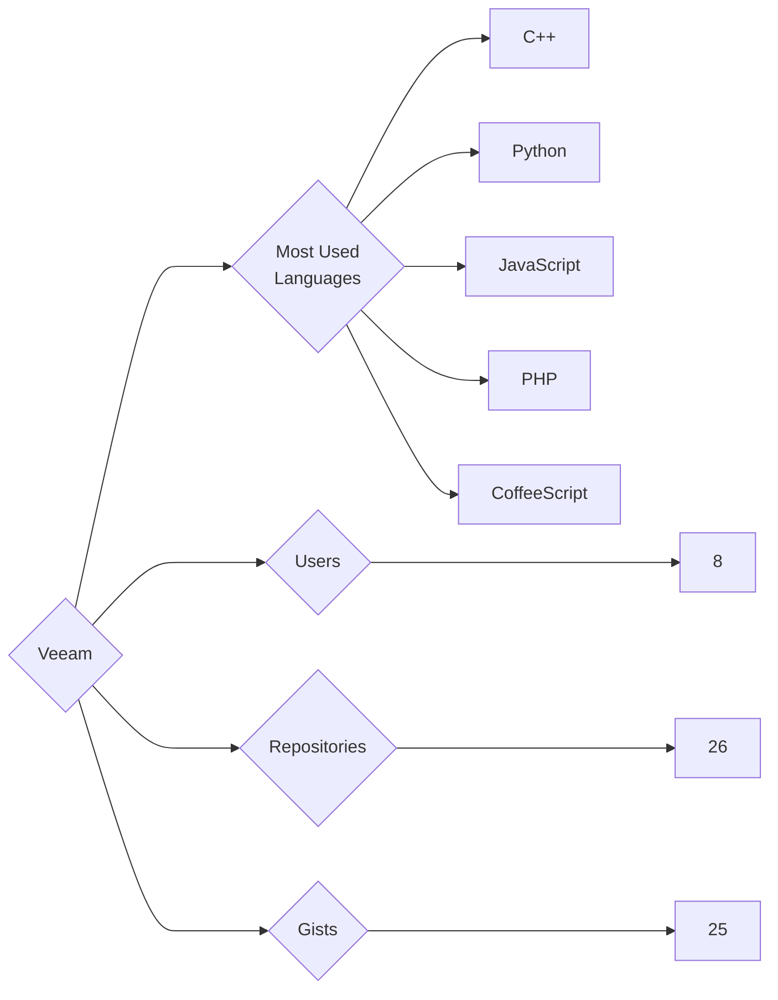

<h1 align="center">Veeam</h1>

```mermaid
graph LR
COMPANY_NAME{Veeam}
COMPANY_NAME ---> U{Users} ---> UN[8]
COMPANY_NAME ---> R{Repositories} ---> RN[26]
COMPANY_NAME ---> G{Gists} ---> GN[25]
COMPANY_NAME ---> ML{Most Used<br>Languages}
ML --> C++[C++]
ML --> Python[Python]
ML --> JavaScript[JavaScript]
ML --> PHP[PHP]
ML --> CoffeeScript[CoffeeScript]
```
