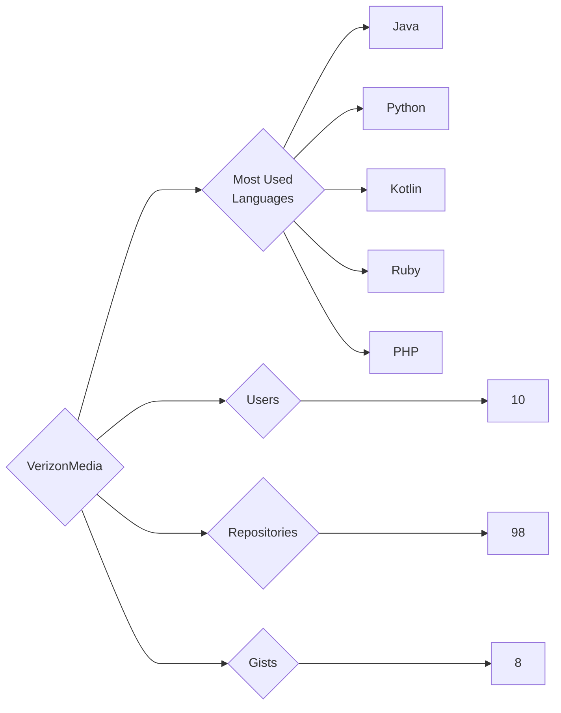

<h1 align="center">VerizonMedia</h1>

```mermaid
graph LR
COMPANY_NAME{VerizonMedia}
COMPANY_NAME ---> U{Users} ---> UN[10]
COMPANY_NAME ---> R{Repositories} ---> RN[98]
COMPANY_NAME ---> G{Gists} ---> GN[8]
COMPANY_NAME ---> ML{Most Used<br>Languages}
ML --> Java[Java]
ML --> Python[Python]
ML --> Kotlin[Kotlin]
ML --> Ruby[Ruby]
ML --> PHP[PHP]
```
