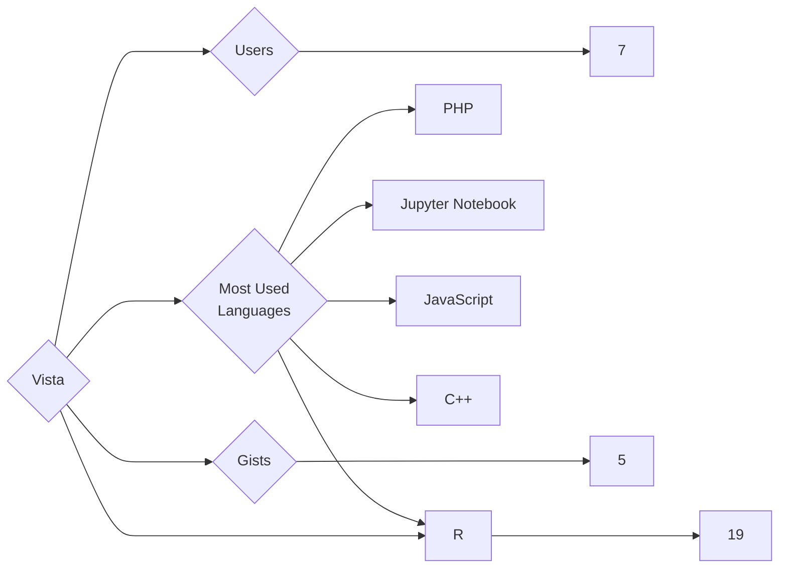

<h1 align="center">Vista</h1>

```mermaid
graph LR
COMPANY_NAME{Vista}
COMPANY_NAME ---> U{Users} ---> UN[7]
COMPANY_NAME ---> R{Repositories} ---> RN[19]
COMPANY_NAME ---> G{Gists} ---> GN[5]
COMPANY_NAME ---> ML{Most Used<br>Languages}
ML --> PHP[PHP]
ML --> R[R]
ML --> Jupyter_Notebook[Jupyter Notebook]
ML --> JavaScript[JavaScript]
ML --> C++[C++]
```
