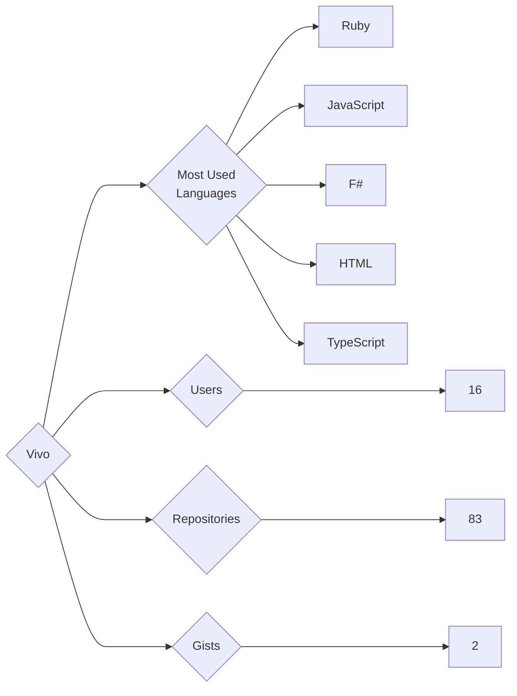

<h1 align="center">Vivo</h1>

```mermaid
graph LR
COMPANY_NAME{Vivo}
COMPANY_NAME ---> U{Users} ---> UN[16]
COMPANY_NAME ---> R{Repositories} ---> RN[83]
COMPANY_NAME ---> G{Gists} ---> GN[2]
COMPANY_NAME ---> ML{Most Used<br>Languages}
ML --> Ruby[Ruby]
ML --> JavaScript[JavaScript]
ML --> F#[F#]
ML --> HTML[HTML]
ML --> TypeScript[TypeScript]
```
