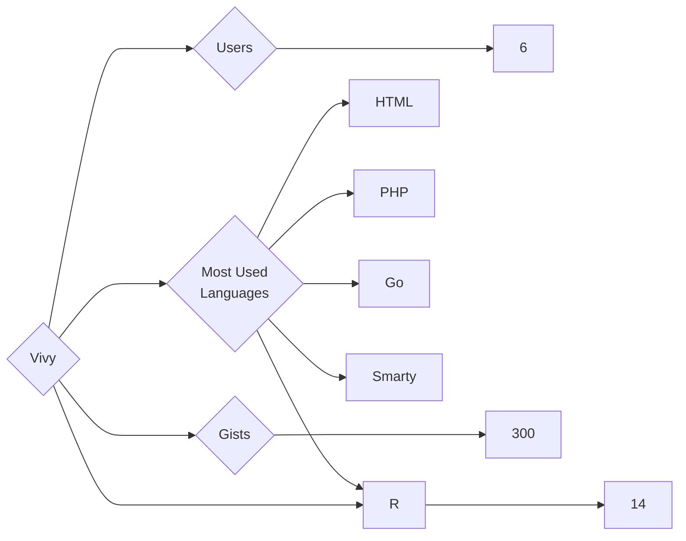

<h1 align="center">Vivy</h1>

```mermaid
graph LR
COMPANY_NAME{Vivy}
COMPANY_NAME ---> U{Users} ---> UN[6]
COMPANY_NAME ---> R{Repositories} ---> RN[14]
COMPANY_NAME ---> G{Gists} ---> GN[300]
COMPANY_NAME ---> ML{Most Used<br>Languages}
ML --> HTML[HTML]
ML --> R[R]
ML --> PHP[PHP]
ML --> Go[Go]
ML --> Smarty[Smarty]
```
