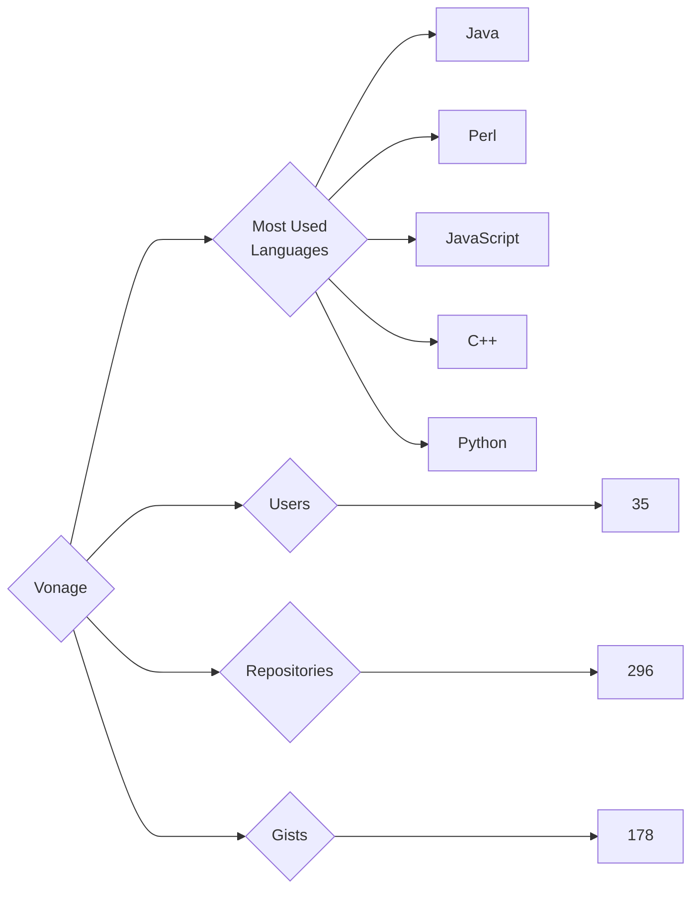

<h1 align="center">Vonage</h1>

```mermaid
graph LR
COMPANY_NAME{Vonage}
COMPANY_NAME ---> U{Users} ---> UN[35]
COMPANY_NAME ---> R{Repositories} ---> RN[296]
COMPANY_NAME ---> G{Gists} ---> GN[178]
COMPANY_NAME ---> ML{Most Used<br>Languages}
ML --> Java[Java]
ML --> Perl[Perl]
ML --> JavaScript[JavaScript]
ML --> C++[C++]
ML --> Python[Python]
```
