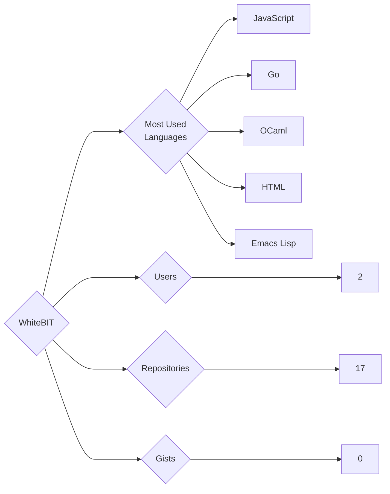

<h1 align="center">WhiteBIT</h1>

```mermaid
graph LR
COMPANY_NAME{WhiteBIT}
COMPANY_NAME ---> U{Users} ---> UN[2]
COMPANY_NAME ---> R{Repositories} ---> RN[17]
COMPANY_NAME ---> G{Gists} ---> GN[0]
COMPANY_NAME ---> ML{Most Used<br>Languages}
ML --> JavaScript[JavaScript]
ML --> Go[Go]
ML --> OCaml[OCaml]
ML --> HTML[HTML]
ML --> Emacs_Lisp[Emacs Lisp]
```
