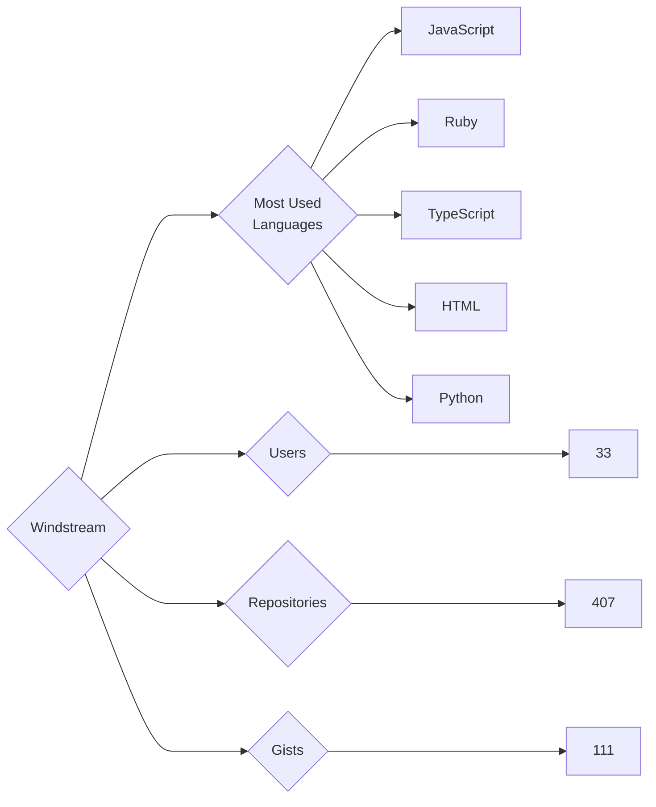

<h1 align="center">Windstream</h1>

```mermaid
graph LR
COMPANY_NAME{Windstream}
COMPANY_NAME ---> U{Users} ---> UN[33]
COMPANY_NAME ---> R{Repositories} ---> RN[407]
COMPANY_NAME ---> G{Gists} ---> GN[111]
COMPANY_NAME ---> ML{Most Used<br>Languages}
ML --> JavaScript[JavaScript]
ML --> Ruby[Ruby]
ML --> TypeScript[TypeScript]
ML --> HTML[HTML]
ML --> Python[Python]
```
