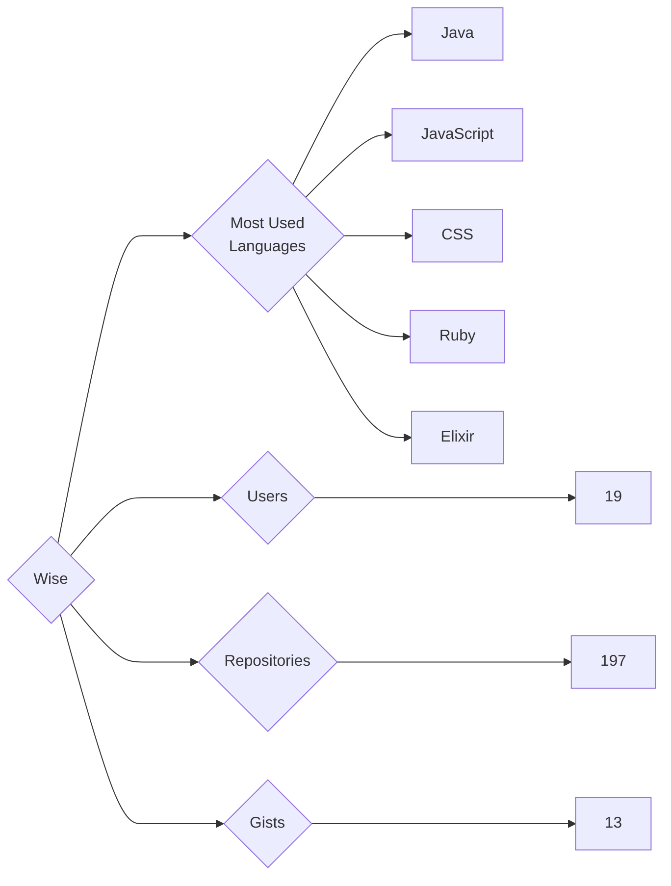

<h1 align="center">Wise</h1>

```mermaid
graph LR
COMPANY_NAME{Wise}
COMPANY_NAME ---> U{Users} ---> UN[19]
COMPANY_NAME ---> R{Repositories} ---> RN[197]
COMPANY_NAME ---> G{Gists} ---> GN[13]
COMPANY_NAME ---> ML{Most Used<br>Languages}
ML --> Java[Java]
ML --> JavaScript[JavaScript]
ML --> CSS[CSS]
ML --> Ruby[Ruby]
ML --> Elixir[Elixir]
```
