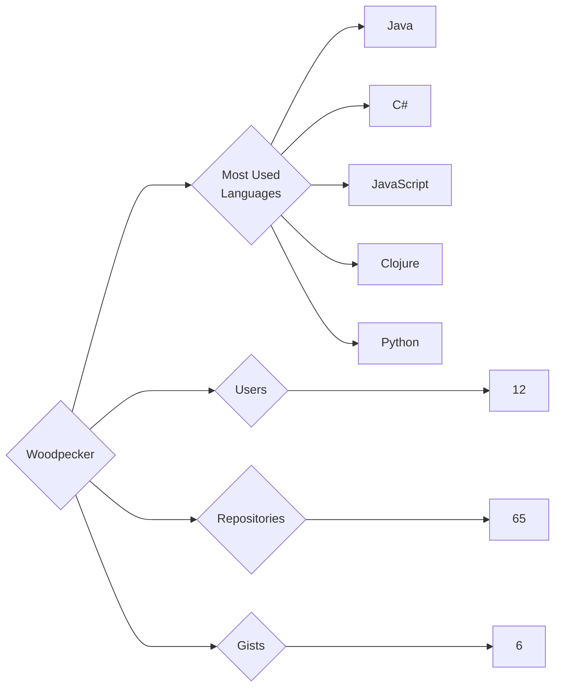

<h1 align="center">Woodpecker</h1>

```mermaid
graph LR
COMPANY_NAME{Woodpecker}
COMPANY_NAME ---> U{Users} ---> UN[12]
COMPANY_NAME ---> R{Repositories} ---> RN[65]
COMPANY_NAME ---> G{Gists} ---> GN[6]
COMPANY_NAME ---> ML{Most Used<br>Languages}
ML --> Java[Java]
ML --> C#[C#]
ML --> JavaScript[JavaScript]
ML --> Clojure[Clojure]
ML --> Python[Python]
```
