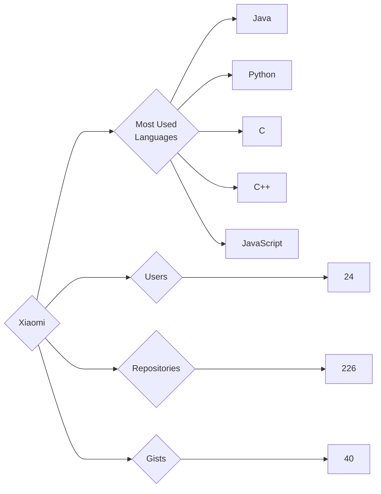

<h1 align="center">Xiaomi</h1>

```mermaid
graph LR
COMPANY_NAME{Xiaomi}
COMPANY_NAME ---> U{Users} ---> UN[24]
COMPANY_NAME ---> R{Repositories} ---> RN[226]
COMPANY_NAME ---> G{Gists} ---> GN[40]
COMPANY_NAME ---> ML{Most Used<br>Languages}
ML --> Java[Java]
ML --> Python[Python]
ML --> C[C]
ML --> C++[C++]
ML --> JavaScript[JavaScript]
```
