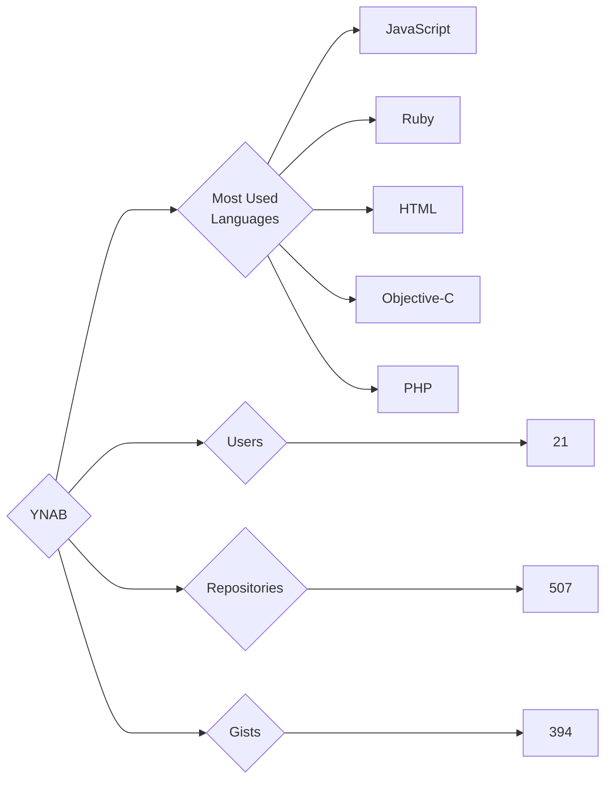

<h1 align="center">YNAB</h1>

```mermaid
graph LR
COMPANY_NAME{YNAB}
COMPANY_NAME ---> U{Users} ---> UN[21]
COMPANY_NAME ---> R{Repositories} ---> RN[507]
COMPANY_NAME ---> G{Gists} ---> GN[394]
COMPANY_NAME ---> ML{Most Used<br>Languages}
ML --> JavaScript[JavaScript]
ML --> Ruby[Ruby]
ML --> HTML[HTML]
ML --> Objective-C[Objective-C]
ML --> PHP[PHP]
```
