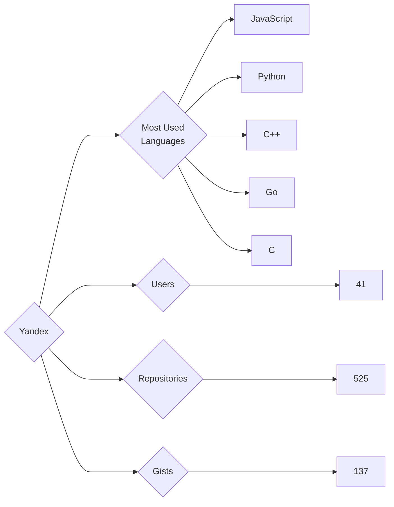

<h1 align="center">Yandex</h1>

```mermaid
graph LR
COMPANY_NAME{Yandex}
COMPANY_NAME ---> U{Users} ---> UN[41]
COMPANY_NAME ---> R{Repositories} ---> RN[525]
COMPANY_NAME ---> G{Gists} ---> GN[137]
COMPANY_NAME ---> ML{Most Used<br>Languages}
ML --> JavaScript[JavaScript]
ML --> Python[Python]
ML --> C++[C++]
ML --> Go[Go]
ML --> C[C]
```
