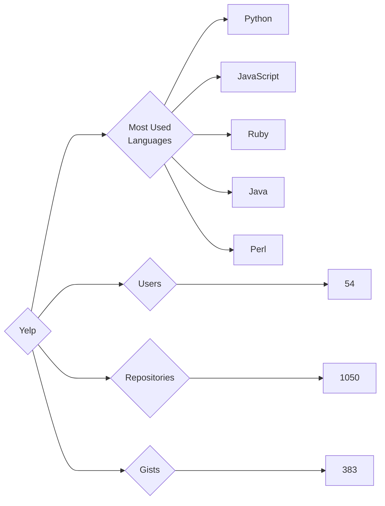

<h1 align="center">Yelp</h1>

```mermaid
graph LR
COMPANY_NAME{Yelp}
COMPANY_NAME ---> U{Users} ---> UN[54]
COMPANY_NAME ---> R{Repositories} ---> RN[1050]
COMPANY_NAME ---> G{Gists} ---> GN[383]
COMPANY_NAME ---> ML{Most Used<br>Languages}
ML --> Python[Python]
ML --> JavaScript[JavaScript]
ML --> Ruby[Ruby]
ML --> Java[Java]
ML --> Perl[Perl]
```
