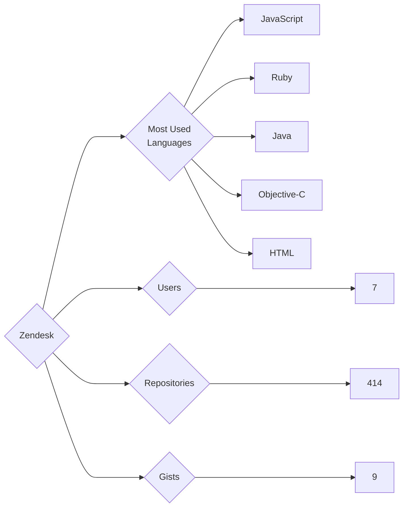

<h1 align="center">Zendesk</h1>

```mermaid
graph LR
COMPANY_NAME{Zendesk}
COMPANY_NAME ---> U{Users} ---> UN[7]
COMPANY_NAME ---> R{Repositories} ---> RN[414]
COMPANY_NAME ---> G{Gists} ---> GN[9]
COMPANY_NAME ---> ML{Most Used<br>Languages}
ML --> JavaScript[JavaScript]
ML --> Ruby[Ruby]
ML --> Java[Java]
ML --> Objective-C[Objective-C]
ML --> HTML[HTML]
```
