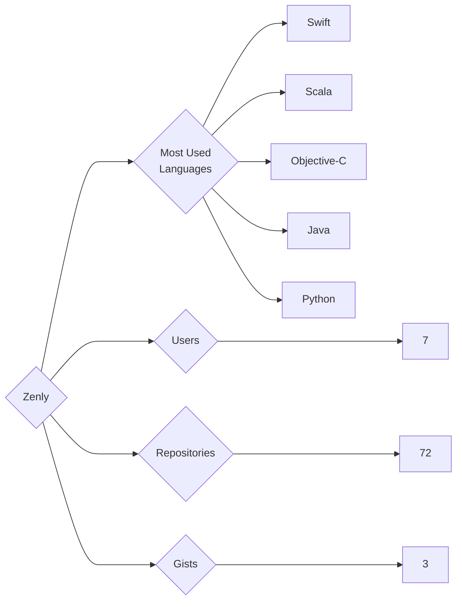

<h1 align="center">Zenly</h1>

```mermaid
graph LR
COMPANY_NAME{Zenly}
COMPANY_NAME ---> U{Users} ---> UN[7]
COMPANY_NAME ---> R{Repositories} ---> RN[72]
COMPANY_NAME ---> G{Gists} ---> GN[3]
COMPANY_NAME ---> ML{Most Used<br>Languages}
ML --> Swift[Swift]
ML --> Scala[Scala]
ML --> Objective-C[Objective-C]
ML --> Java[Java]
ML --> Python[Python]
```
