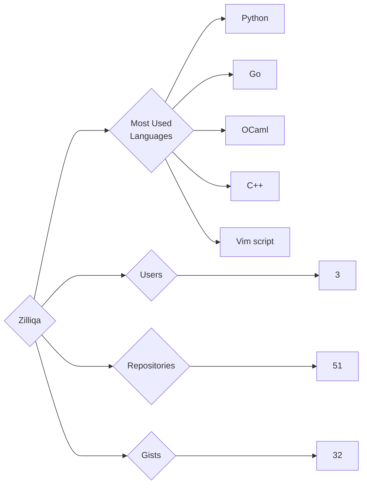

<h1 align="center">Zilliqa</h1>

```mermaid
graph LR
COMPANY_NAME{Zilliqa}
COMPANY_NAME ---> U{Users} ---> UN[3]
COMPANY_NAME ---> R{Repositories} ---> RN[51]
COMPANY_NAME ---> G{Gists} ---> GN[32]
COMPANY_NAME ---> ML{Most Used<br>Languages}
ML --> Python[Python]
ML --> Go[Go]
ML --> OCaml[OCaml]
ML --> C++[C++]
ML --> Vim_script[Vim script]
```
