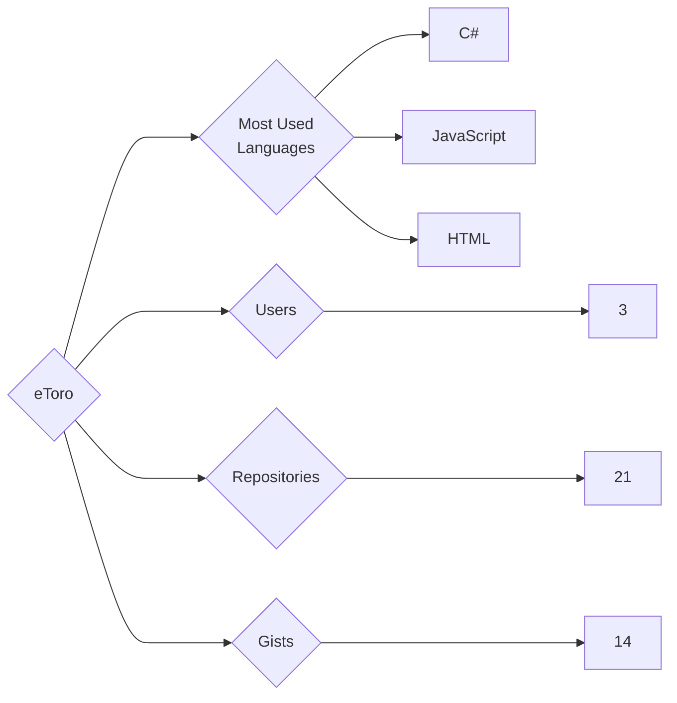

<h1 align="center">eToro</h1>

```mermaid
graph LR
COMPANY_NAME{eToro}
COMPANY_NAME ---> U{Users} ---> UN[3]
COMPANY_NAME ---> R{Repositories} ---> RN[21]
COMPANY_NAME ---> G{Gists} ---> GN[14]
COMPANY_NAME ---> ML{Most Used<br>Languages}
ML --> C#[C#]
ML --> JavaScript[JavaScript]
ML --> HTML[HTML]
```
